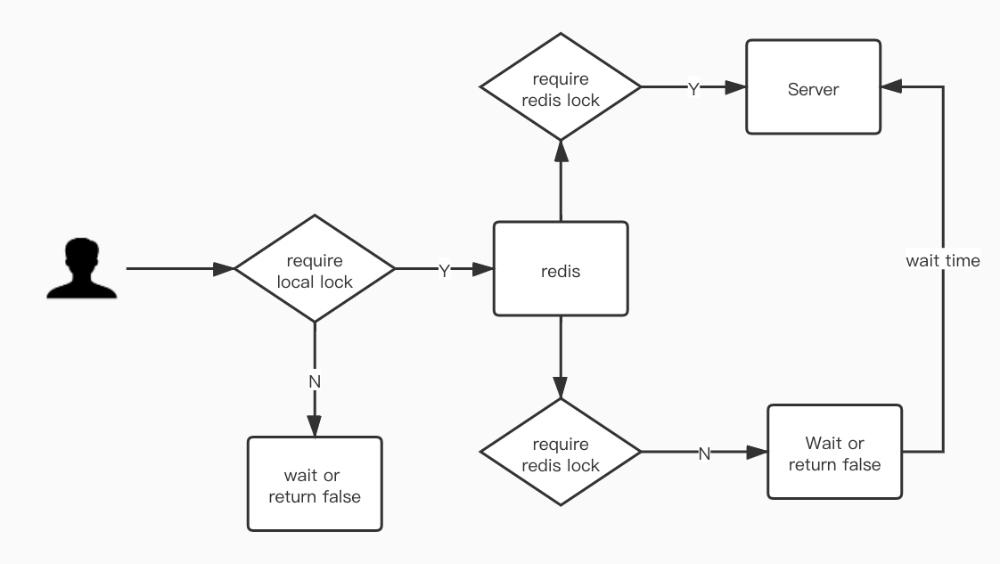

## Redis Distributed Kit

this repo uses local sync lock and redis lock to provide high performance redis tools



### Import Redis Kit in your project
```xml
<dependency>
    <groupId>com.github.jsrdxzw</groupId>
    <artifactId>redis-kit-spring-boot-starter</artifactId>
    <version>1.0.5</version>
</dependency>
<dependency>
    <groupId>org.springframework.boot</groupId>
    <artifactId>spring-boot-starter-data-redis</artifactId>
</dependency> 
```

```java
import com.jsrdxzw.redis.core.EnableRedisKit;

@EnableRedisKit
public class SpringBootApplication {
    public static void main(String[] args) {
        SpringApplication.run(SpringBootApplication.class, args);
    }
}
```

### Use Distributed Lock

by default `StringRedisTemplate` which is provided by Spring is used, Of course you can choose other RedisTemplate by
yourself.

```java
@Configuration
public class DistributedLockConfiguration{
    @Bean
    public RedisLockFactory redisLockFactory(StringRedisTemplate redisTemplate){
        return new DefaultRedisLockFactory(redisTemplate);
    }
}
```
use lock in your own business logic code

```java
public class UserService {
    @Autowired
    private RedisLockFactory redisLockFactory;

    public void method() {
        RedisLock RLock = redisLockFactory.getLock("xzw");
        try {
            //RLock.lock(); by default the expire time is 60s
            // set expire time is recommended because busy waiting may cause deadlock
            // when redis machine is down..
            RLock.tryLock(30, TimeUnit.SECONDS);
            //RLock.tryLock(30, TimeUnit.SECONDS, 3);
            // your own logic
        } finally {
            RLock.unlock();
        }
    }
}
```
In the other way, annotations such as `@DistributedLock`, `DistributedTryLock` are also provided, please import the spring aop at the first place
before using annotations.
```xml
<dependency>
    <groupId>org.springframework.boot</groupId>
    <artifactId>spring-boot-starter-aop</artifactId>
</dependency>
```
```java
import org.springframework.boot.autoconfigure.SpringBootApplication;import org.springframework.context.annotation.ComponentScan;@ComponentScan

@SpringBootApplication(scanBasePackages = {"your.path", "com.jsrdxzw.redis"})
public class Application{
    public static void main(String[] args) {
            SpringApplication.run(Application.class, args);
    }
}
```

### example of distributed lock by annotation

```java
// @DistributedLock(lockKey = "your key")
@DistributedTryLock(lockKey = "your key", waitTime = 10)
public void method(){
        //...
        }
```

### enable preload mode

we support preload mode from v1.0.4 that means the lua script is preloaded before used. it can save memory and increase
performance.

```yaml
# by default preload mode is disabled 
redis-kit:
  preload: true
```

### Redis Cache Example

it will get value from redis and if the key does not exist in redis it will go on next process and put value in redis as
cache. by default the expired time is `5 minutes`.

```java
@Cache(key = "xzw")
public Student methodName(){
        }
```
it will remove redis value based on cache principle -- [Cache aside](https://www.usenix.org/system/files/conference/nsdi13/nsdi13-final170_update.pdf)

it is recommended to use @Transactional annotation when modifying
cache values

```java
@Transactional(rollbackFor = Throwable.class)
@Put(key="xzw")
public Student methodName() {
}
```
`@Delete` is same as `@Put`

```java
@Transactional(rollbackFor = Throwable.class)
@Delete(key="xzw")
public void methodName() {
}
```
it will delete value from redis

### rate limiter
```java
import org.springframework.beans.factory.annotation.Autowired;

@Autowired
private RateLimit rateLimit;

boolean require = rateLimit.acquire("xzw", 5, 10);
```
it means we allow 5 requests per seconds, and when the request of per second is greater than 5, it will return false

we have provided two algorithms -- token bucket and rolling window.
token bucket algorithm is used by default 

```yaml
# you can change limit algorithm by overriding spring yaml file
redis-kit:
  rate-limit: rollingWindow
```
